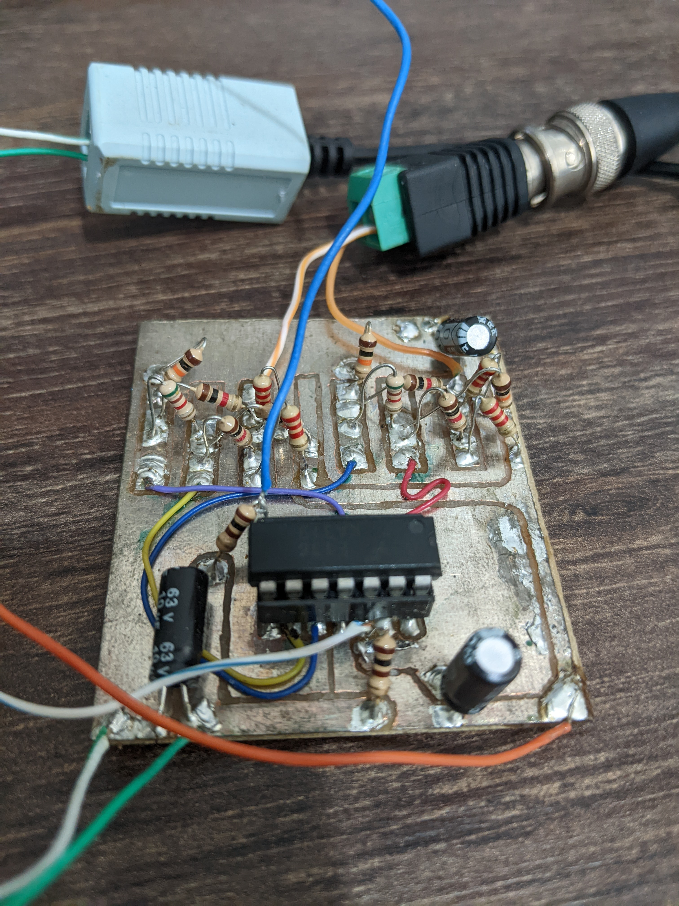

# E1/T1 interface board for Tang Nano 9k

This is a simple adapter for connecting a FPGA board to an E1/T1 interface via short distance twisted pair.

RX is done by a couple of comparators (KA319 or LM319) which detect, respectively, positive (`RXP_N` low) and negative (`RXN_N` low) pulses.

TX is done directly by the FPGA pins. Current flows either from `TXP` to `TXN` to produce a positive pulse, or from `TXN` to `TXP` to produce a negative pulse.

The FPGA design is one of the exercises of the [Communications Technology class](https://telecom.matias.co.in) at [UFSCar](https://ufscar.br). Starter files and a guide for developing the project can be found [here](https://github.com/thotypous/telecom-p2).

## Schematics

Schematics are available both in [PDF](board/board.pdf) and in [Kicad format](board/board.kicad_sch).

## PCB

We don't have a proper PCB layout. Please feel free to contribute one.

Instead, please see below some photos of our milled by hand prototype board.

Please note that although one should ideally use 1:1 transformers, we only had at hand a couple of security camera baluns (designed to work as 75 ohm to 100 ohm impedance transformers), which worked just fine.
